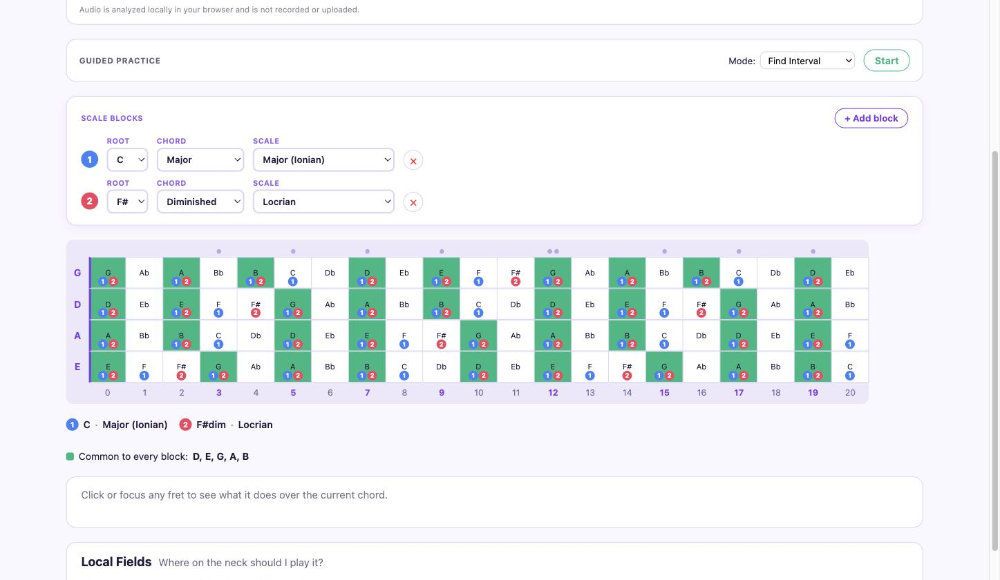
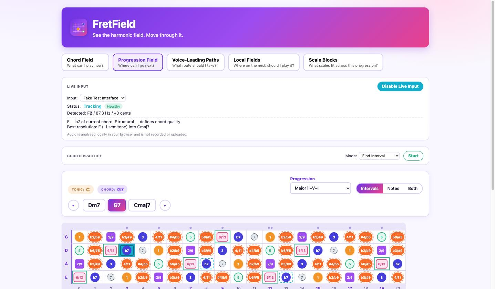
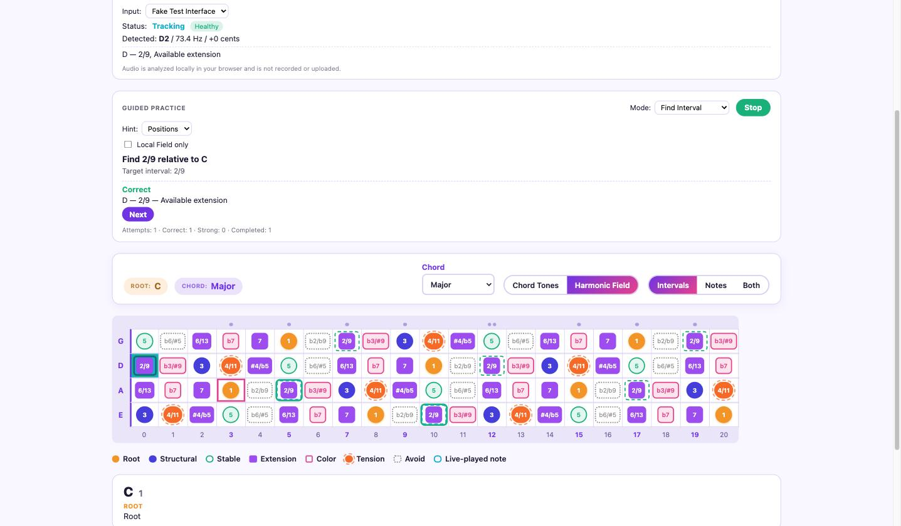
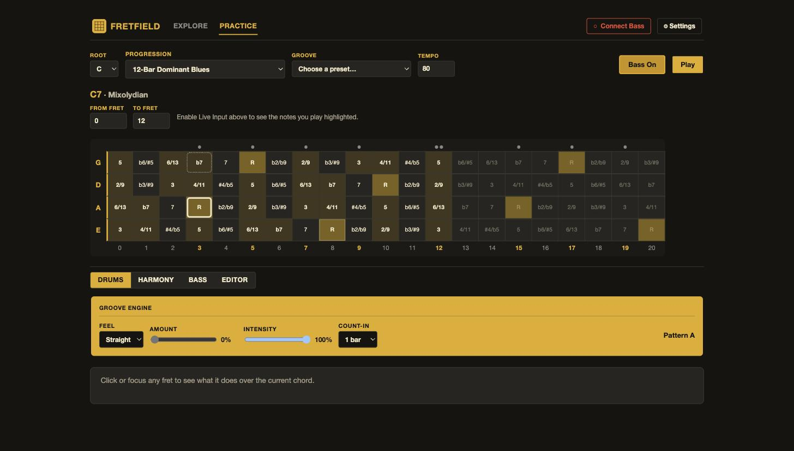

<p align="center">
  
</p>

<p align="center">
  <a href="https://github.com/alessandrobessi/fretfield/actions/workflows/ci.yml"></a>
  <a href="https://github.com/alessandrobessi/fretfield/actions/workflows/deploy.yml"></a>
  <a href="https://alessandrobessi.github.io/fretfield/"></a>
</p>

FretField is an interactive bass-fretboard application that teaches the neck as a spatial field of harmonic possibilities — not a grid of shapes to memorize. It's organized around three destinations, not a flat list of modes:

|                 |                                                                                                                                    |
| --------------- | ---------------------------------------------------------------------------------------------------------------------------------- |
| 🔎 **Explore**  | Click any fret to set a root and ask what's true about the neck right now — one chord, a whole progression, or a scale on its own. |
| 🎯 **Practice** | Turn any of those questions into an exercise, or open a curated Preset and start immediately, without configuring anything first.  |
| 📈 **Progress** | Coming soon.                                                                                                                       |

**Explore** answers three increasingly wide questions, each its own lens rather than a separate page:

|                       |                                              |                                                                                                                                                                                                                                                                                                                                                                                                                    |
| --------------------- | -------------------------------------------- | ------------------------------------------------------------------------------------------------------------------------------------------------------------------------------------------------------------------------------------------------------------------------------------------------------------------------------------------------------------------------------------------------------------------ |
| 🎯 **Chord**          | _What can I play now?_                       | The full 12-tone Harmonic Field over the current chord — root, structural, stable, extension, color, tension, alteration, chromatic-approach, avoid — or a simplified Chord Tones view for quick reference.                                                                                                                                                                                                        |
| ➡️ **Progression**    | _Where can I go next?_                       | One workspace, three lenses on a resolved progression template (ii–V–I, I–vi–ii–V, 12-bar blues, …): **Connections** (each note's best resolution into the next chord), **Paths** (ranked complete fretted routes through the whole progression, with Balanced / Minimal Movement / Guide Tones presets), and **Scales** (an auto-suggested scale per chord, overridable, with a "common to every chord" callout). |
| 🧭 **Scale Explorer** | _What does this scale look like on its own?_ | A single root + scale, highlighted on the neck, independent of any chord or progression.                                                                                                                                                                                                                                                                                                                           |

**Position** (where on the neck to play something — ranked suggested regions or a typed-in fret range) and **Bass** (an optional live-pitch-detection layer: play your bass through a USB interface or mic and FretField highlights what you actually played) are both global capabilities, not destinations of their own — Position works from every Explore lens and Practice activity, Bass is a single header toggle. Audio is analyzed locally in your browser and never recorded or uploaded.

**Practice** covers five activities plus a curated Presets library:

|                     |                                                                                                                                                                                             |
| ------------------- | ------------------------------------------------------------------------------------------------------------------------------------------------------------------------------------------- |
| **Find Interval**   | Locate a given interval relative to the root, anywhere on the neck.                                                                                                                         |
| **Find Chord Tone** | Locate a structural note of the current chord.                                                                                                                                              |
| **Resolve Note**    | Given a note, find a strong resolution into the next chord.                                                                                                                                 |
| **Follow Path**     | Follow a selected voice-leading path through a progression, one step at a time.                                                                                                             |
| **Scales**          | Pick a root, a scale, and a fret zone; every fret shows its interval plus note name, scale notes light up, whatever you play is highlighted live, and a free-standing metronome keeps time. |
| **Presets**         | Fifteen curated one-click sessions (Essential / Voice Leading / Scales) that configure everything above and start immediately.                                                              |

The first four are Guided Practice: FretField proposes a target, you find and play it, Bass detects it, and FretField explains what happened — exact, a strong or valid alternative, or not quite, never a flat right/wrong. Scales is a separate, deliberately timer-driven engine (Guided Practice is self-paced by design; this is where the metronome lives instead) — start/stop only ever controls the click, never the highlighting.

**Try it live:** https://alessandrobessi.github.io/fretfield/

---

## Screenshots

_Pending a refresh for the Explore/Practice/Progress shell — these still show the pre-restructure six-tab layout, though every feature they depict is unchanged, just relocated._

<table>
<tr>
<td width="50%">

**Chord Field** — full Harmonic Field over C7


</td>
<td width="50%">

**Progression Field** — transition-aware inspector


</td>
</tr>
<tr>
<td width="50%">

**Voice-Leading Paths** — ranked fretted routes


</td>
<td width="50%">

**Local Fields** — regions and the neck ruler


</td>
</tr>
<tr>
<td width="50%">

**Scale Blocks** — up to 8 chords' scales overlaid at once, with shared notes called out



</td>
<td width="50%">

**Live Input** — the actual note you played, lit up on the neck



</td>
</tr>
<tr>
<td width="50%">

**Guided Practice** — an exercise loop with live feedback



</td>
<td width="50%">

**Scale Practice** — the whole scale highlighted, plus a free-standing metronome



</td>
</tr>
</table>

---

## How it's built

Music theory lives entirely in pure TypeScript (`src/lib/music/`) with zero Svelte/DOM imports — pitch classes, intervals, chords, harmonic-role classification, progression templates, connection scoring, and an exact dynamic-program voice-leading path search. Svelte components only render what the engine (via a thin Svelte 5 runes store) has already analyzed; no component calculates a third or transposes a pitch class itself. See [`AGENTS.md`](./AGENTS.md) for the full set of architecture rules this repo is built to.

```text
src/lib/music/
├── pitch.ts                  pitch classes, diatonic note spelling
├── intervals.ts               the 12-interval chromatic system
├── tuning.ts / fretboard.ts   tuning abstraction, fretboard generation
├── chords.ts                  composable chord formulas
├── harmony.ts                 chord-family-aware Harmonic Role classification
├── local-fields.ts            ranked, overlapping neck regions
├── progressions.ts            declarative progression templates
├── connection-score.ts        pitch-class-level resolution scoring
├── voice-leading.ts           full-field transition analysis
├── voice-leading-paths.ts     exact-DP path search across a progression
├── absolute-pitch.ts          MIDI-based fretboard mapping for Live Input
├── live-position.ts           ambiguous-position ranking for Live Input
└── scales.ts                  scale definitions + family-aware suggestions, for Scale Blocks and Scale Practice

src/lib/audio/
├── types.ts                   DetectedNote, LiveNoteState, the LiveAudioSource abstraction
├── pitch-detector.ts          YIN fundamental-frequency detection
├── pitch-tracker.ts           temporal stabilization (onset/sustain/release)
├── note-mapping.ts            frequency ↔ MIDI ↔ pitch-class conversions
├── audio-input.ts             real browser capture (getUserMedia + AnalyserNode)
├── fake-audio-source.ts       deterministic capture double, used by tests
└── metronome.ts                Scale Practice's click — the app's only audio *output*, a separate AudioContext from capture

src/lib/practice/
├── types.ts                   PracticeSession/Exercise/Target/Evaluation — structured, not UI strings
├── evaluation.ts               centralized exact/strong/valid/incorrect scoring, reused from connection-score.ts
├── exercise-generators.ts      one generator per mode, deterministic with an injectable random source
├── practice-engine.ts          the pure prompting → waiting-for-note → feedback session state machine
└── presets.ts                  mode labels, default settings/thresholds

src/lib/scale-practice/
├── types.ts                   PracticeZone — deliberately separate from $lib/practice's types
└── positions.ts                every fret position a scale/root/zone covers — no grading, just positions
```

`src/lib/audio/` only ever knows about acoustic pitch — frequency, MIDI, confidence. It has no concept of a chord, a key, or a role; that meaning is layered on afterward by `src/lib/stores/live-input.svelte.ts` and the main store, which combine a detected note with whatever `src/lib/music/` analysis is already on screen.

`src/lib/practice/` decides what exercise is active and whether a played note satisfies it — it never re-implements harmonic theory itself. A Resolve Note exercise's "F resolves to E" target comes from calling the same `analyzeConnection`/`connectionFor` functions the Progression workspace's Connections lens already uses; a Follow Path exercise reuses whichever `VoiceLeadingPath` is already selected, unchanged for the whole exercise.

`src/lib/scale-practice/` is kept separate from `src/lib/practice/` on purpose: Guided Practice's engine and its doctrine (see `AGENTS.md`) are both explicitly self-paced and timer-free, and this mode's metronome is exactly the timing concept that doctrine excludes. Its `ScalePracticeStore` (`src/lib/stores/scale-practice.svelte.ts`) exposes two things independently of each other: `scalePositions` (every note of the configured scale within the zone, always on) and `playedPositions` (a live derived reading `liveInput.detectedNote` directly — whatever's currently sounding, highlighted in real time). The metronome (`start()`/`stop()`, a self-correcting `setTimeout` loop) only plays a click; it has no effect on either derived.

Every non-trivial harmonic claim in the engine is checked against a concrete example from the product spec rather than "the tests pass" alone — e.g. the full Harmonic Field over C7 is asserted against BLUEPRINT.md's own worked table, and G7→Cmaj7's guide-tone resolutions (F→E, B→C) are asserted by name.

## Stack

pnpm, TypeScript, SvelteKit, Svelte 5, Vitest, Playwright.

## Developing

```sh
pnpm install
pnpm dev -- --open
```

## Checks

```sh
pnpm lint       # prettier + eslint
pnpm check      # svelte-check / TypeScript
pnpm test:unit  # vitest — the music engine's invariants live here
pnpm test:e2e   # playwright — full user flows across Explore's lenses, Practice's activities and presets, Bass, and onboarding
pnpm build      # production build
```

## Deployment

Pushing to `main` builds and deploys the app to GitHub Pages via `.github/workflows/deploy.yml`. The build is a static export (`@sveltejs/adapter-static`) served from the `/fretfield` subpath. Selected root, mode, chord, display settings, progression, and region are all reflected in the URL, so any view is shareable as a link.

## Docs

- [`BLUEPRINT.md`](./BLUEPRINT.md) — product concept and technical design
- [`ROADMAP.md`](./ROADMAP.md) — development plan and current status
- [`AGENTS.md`](./AGENTS.md) — operating rules for coding agents working on this repo
