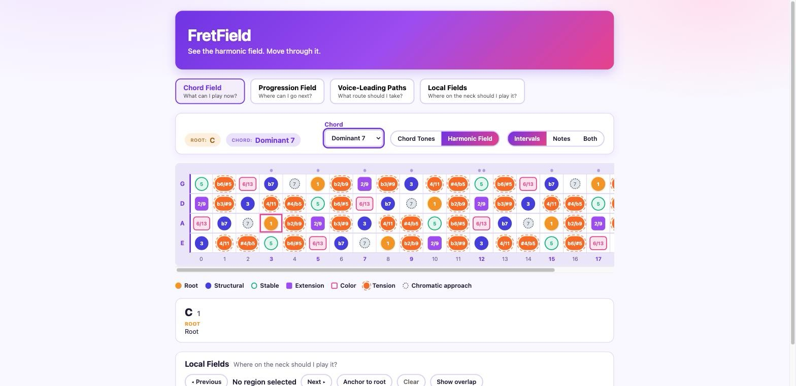
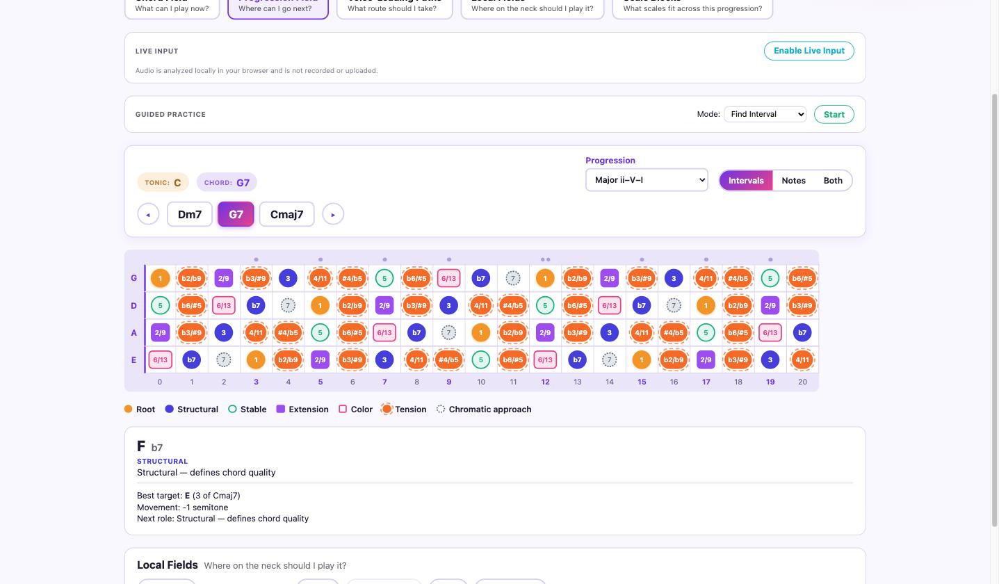
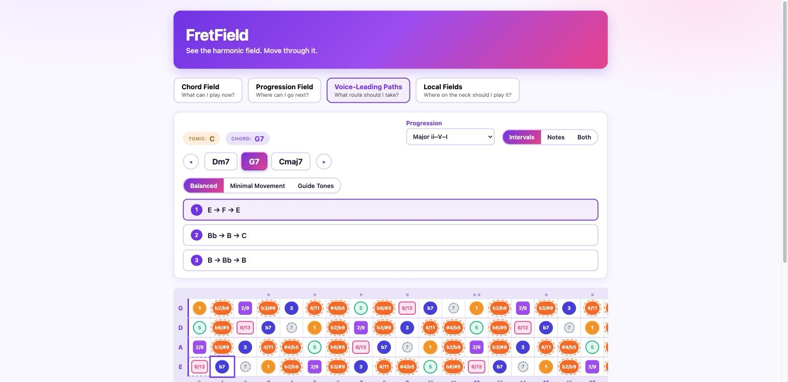
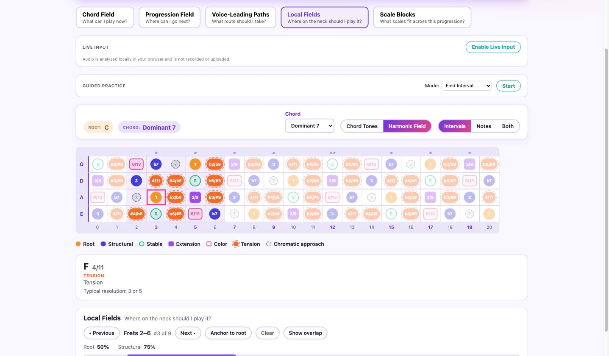

<p align="center">
  
</p>

<p align="center">
  <a href="https://github.com/alessandrobessi/fretfield/actions/workflows/ci.yml"></a>
  <a href="https://github.com/alessandrobessi/fretfield/actions/workflows/deploy.yml"></a>
  <a href="https://alessandrobessi.github.io/fretfield/"></a>
</p>

FretField is an interactive bass-fretboard application that teaches the neck as a spatial field of harmonic possibilities — not a grid of shapes to memorize. Click any fret to set a root, and it answers five increasingly powerful questions:

|                            |                                            |                                                                                                                                                                                                                |
| -------------------------- | ------------------------------------------ | -------------------------------------------------------------------------------------------------------------------------------------------------------------------------------------------------------------- |
| 🎯 **Chord Field**         | _What can I play now?_                     | The full 12-tone Harmonic Field over the current chord — root, structural, stable, extension, color, tension, alteration, chromatic-approach, avoid — or a simplified Chord Tones view for quick reference.    |
| ➡️ **Progression Field**   | _Where can I go next?_                     | Resolve a progression template (ii–V–I, I–vi–ii–V, 12-bar blues, …) from the selected root and see each note's best resolution into the next chord, derived from interval math — not a hardcoded lookup table. |
| 🧭 **Voice-Leading Paths** | _What route should I take?_                | A ranked list of complete fretted paths through the whole progression, scored by harmonic quality, physical movement, and position continuity, with Balanced / Minimal Movement / Guide Tones presets.         |
| 📍 **Local Fields**        | _Where on the neck should I play it?_      | Ranked, overlapping regions of the neck — not fixed CAGED-style boxes — usable as a lens under any of the other three modes.                                                                                   |
| 🧩 **Scale Blocks**        | _What scales fit across this progression?_ | Build up to 4 independent chord "blocks" — each its own root, quality, and scale — and see all of them at once: every fret numbered/colored by which block's scale it belongs to, overlaps included.           |

**Live Input** is an optional layer over all five modes, not a `FieldMode` itself: play your bass through a USB audio interface or mic and FretField reacts to what you actually play. It detects the pitch and highlights every fret that physically produces it everywhere, including Scale Blocks; the deeper explanation — Chord Field's role, Progression Field's resolution into the next chord, or a Voice-Leading Path's expected next note — is available for those three modes specifically. Off by default; audio is analyzed locally in your browser and never recorded or uploaded.

**Guided Practice** turns the four single-chord modes into exercises, closing the loop: FretField proposes a target (find an interval, find a chord tone, resolve a note into the next chord, or follow a voice-leading path one step at a time), you find and play it, Live Input detects it, and FretField explains what happened — exact, a strong or valid alternative, or not quite, never a flat right/wrong. Not a `FieldMode` either; it's built entirely on the existing questions and the same harmonic engine, and doesn't currently drive Scale Blocks.

**Scale Blocks** _is_ its own mode (the "🧩" row above) — a genuinely different, simultaneous view rather than a layer over the other four: build up to 4 independent chord blocks and see every one of their scales overlaid on the neck at once, each fret numbered and colored by which block(s) it belongs to.

**Try it live:** https://alessandrobessi.github.io/fretfield/

---

## Screenshots

<table>
<tr>
<td width="50%">

**Chord Field** — full Harmonic Field over C7



</td>
<td width="50%">

**Progression Field** — transition-aware inspector



</td>
</tr>
<tr>
<td width="50%">

**Voice-Leading Paths** — ranked fretted routes



</td>
<td width="50%">

**Local Fields** — regions and the neck ruler



</td>
</tr>
</table>

---

## How it's built

Music theory lives entirely in pure TypeScript (`src/lib/music/`) with zero Svelte/DOM imports — pitch classes, intervals, chords, harmonic-role classification, progression templates, connection scoring, and an exact dynamic-program voice-leading path search. Svelte components only render what the engine (via a thin Svelte 5 runes store) has already analyzed; no component calculates a third or transposes a pitch class itself. See [`AGENTS.md`](./AGENTS.md) for the full set of architecture rules this repo is built to.

```text
src/lib/music/
├── pitch.ts                  pitch classes, diatonic note spelling
├── intervals.ts               the 12-interval chromatic system
├── tuning.ts / fretboard.ts   tuning abstraction, fretboard generation
├── chords.ts                  composable chord formulas
├── harmony.ts                 chord-family-aware Harmonic Role classification
├── local-fields.ts            ranked, overlapping neck regions
├── progressions.ts            declarative progression templates
├── connection-score.ts        pitch-class-level resolution scoring
├── voice-leading.ts           full-field transition analysis
├── voice-leading-paths.ts     exact-DP path search across a progression
├── absolute-pitch.ts          MIDI-based fretboard mapping for Live Input
├── live-position.ts           ambiguous-position ranking for Live Input
└── scales.ts                  scale definitions + family-aware suggestions, for Scale Blocks

src/lib/audio/
├── types.ts                   DetectedNote, LiveNoteState, the LiveAudioSource abstraction
├── pitch-detector.ts          YIN fundamental-frequency detection
├── pitch-tracker.ts           temporal stabilization (onset/sustain/release)
├── note-mapping.ts            frequency ↔ MIDI ↔ pitch-class conversions
├── audio-input.ts             real browser capture (getUserMedia + AnalyserNode)
└── fake-audio-source.ts       deterministic capture double, used by tests

src/lib/practice/
├── types.ts                   PracticeSession/Exercise/Target/Evaluation — structured, not UI strings
├── evaluation.ts               centralized exact/strong/valid/incorrect scoring, reused from connection-score.ts
├── exercise-generators.ts      one generator per mode, deterministic with an injectable random source
├── practice-engine.ts          the pure prompting → waiting-for-note → feedback session state machine
└── presets.ts                  mode labels, default settings/thresholds
```

`src/lib/audio/` only ever knows about acoustic pitch — frequency, MIDI, confidence. It has no concept of a chord, a key, or a role; that meaning is layered on afterward by `src/lib/stores/live-input.svelte.ts` and the main store, which combine a detected note with whatever `src/lib/music/` analysis is already on screen.

`src/lib/practice/` decides what exercise is active and whether a played note satisfies it — it never re-implements harmonic theory itself. A Resolve Note exercise's "F resolves to E" target comes from calling the same `analyzeConnection`/`connectionFor` functions Progression Field already uses; a Follow Path exercise reuses whichever `VoiceLeadingPath` is already selected, unchanged for the whole exercise.

Every non-trivial harmonic claim in the engine is checked against a concrete example from the product spec rather than "the tests pass" alone — e.g. the full Harmonic Field over C7 is asserted against BLUEPRINT.md's own worked table, and G7→Cmaj7's guide-tone resolutions (F→E, B→C) are asserted by name.

## Stack

pnpm, TypeScript, SvelteKit, Svelte 5, Vitest, Playwright.

## Developing

```sh
pnpm install
pnpm dev -- --open
```

## Checks

```sh
pnpm lint       # prettier + eslint
pnpm check      # svelte-check / TypeScript
pnpm test:unit  # vitest — the music engine's invariants live here
pnpm test:e2e   # playwright — full user flows across all four modes and Guided Practice
pnpm build      # production build
```

## Deployment

Pushing to `main` builds and deploys the app to GitHub Pages via `.github/workflows/deploy.yml`. The build is a static export (`@sveltejs/adapter-static`) served from the `/fretfield` subpath. Selected root, mode, chord, display settings, progression, and region are all reflected in the URL, so any view is shareable as a link.

## Docs

- [`BLUEPRINT.md`](./BLUEPRINT.md) — product concept and technical design
- [`ROADMAP.md`](./ROADMAP.md) — development plan and current status
- [`AGENTS.md`](./AGENTS.md) — operating rules for coding agents working on this repo
