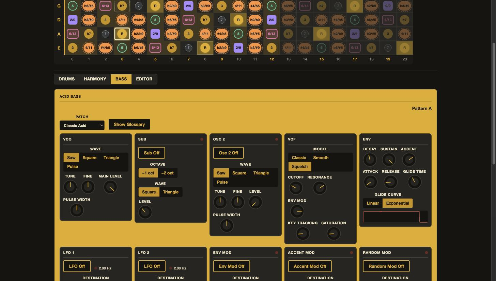
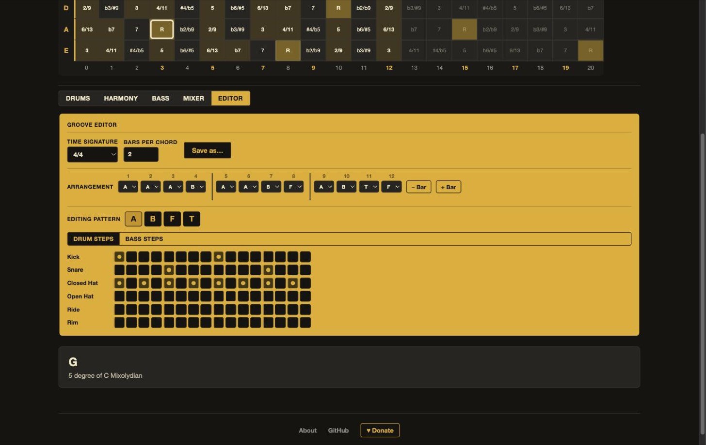

<p align="center">
  
</p>

<p align="center">
  <a href="https://github.com/alessandrobessi/fretfield/actions/workflows/ci.yml"></a>
  <a href="https://github.com/alessandrobessi/fretfield/actions/workflows/deploy.yml"></a>
  <a href="https://alessandrobessi.github.io/fretfield/"></a>
</p>

FretField is an interactive bass-fretboard application that teaches the neck as a spatial field of harmonic possibilities — not a grid of shapes to memorize. By explicit product direction it's deliberately narrow: two destinations, not a flat list of modes.

|                 |                                                                                                                                                                                                                                                                                                                                |
| --------------- | ------------------------------------------------------------------------------------------------------------------------------------------------------------------------------------------------------------------------------------------------------------------------------------------------------------------------------ |
| 🔎 **Explore**  | **Chord Field** — click any fret to set a root, pick a chord, and see the full 12-tone Harmonic Field light up around it: root, structural, stable, extension, color, tension, alteration, chromatic-approach, avoid.                                                                                                          |
| 🎯 **Practice** | **Scale Practice** — pick a root/scale/fret-zone (or a chord progression instead), every note of the scale lights up at once, whatever you actually play is highlighted live, and a synthesized band — a multi-voice drum machine, an optional chord pad, and an optional 303-style Acid Bass synth — keeps time alongside it. |

**Live Input** (an optional layer over both destinations) turns on your bass's actual pitch: play through a USB interface or mic and FretField highlights the real note, live, in Chord Field's harmonic-role colors or Scale Practice's scale tint. Audio is analyzed locally in your browser and never recorded or uploaded.

**Try it live:** https://alessandrobessi.github.io/fretfield/

---

## Screenshots

<table>
<tr>
<td width="50%">

**Chord Field** — the full Harmonic Field over C7


</td>
<td width="50%">

**Scale Practice** — a 12-bar blues, scale-highlighted and chord-backed


</td>
</tr>
<tr>
<td width="50%">

**Acid Bass** — the 303-style synth bass, VCO/VCF/ENV/MOD/OUTPUT



</td>
<td width="50%">

**Groove Editor** — the multi-bar arrangement and step grid



</td>
</tr>
</table>

---

## How it's built

Music theory lives entirely in pure TypeScript (`src/lib/music/`) with zero Svelte/DOM imports — pitch classes, intervals, chords, harmonic-role classification, and progression templates. Svelte components only render what the engine (via a thin Svelte 5 runes store) has already analyzed; no component calculates a third or transposes a pitch class itself. See [`AGENTS.md`](./AGENTS.md) for the full set of architecture rules this repo is built to.

```text
src/lib/music/
├── pitch.ts                  pitch classes, diatonic note spelling
├── intervals.ts               the 12-interval chromatic system
├── tuning.ts / fretboard.ts   tuning abstraction, fretboard generation
├── fret-range.ts               the shared {minFret, maxFret} shape
├── chords.ts                  composable chord formulas
├── harmony.ts                 chord-family-aware Harmonic Role classification
├── progressions.ts            declarative progression templates (Scale Practice's chord backing)
├── absolute-pitch.ts          MIDI-based fretboard mapping for Live Input
├── live-position.ts           ambiguous-position ranking for Live Input
└── scales.ts                  scale definitions + family-aware suggestions

src/lib/audio/
├── types.ts                    DetectedNote, LiveNoteState, the LiveAudioSource abstraction
├── pitch-detector.ts           YIN fundamental-frequency detection
├── pitch-tracker.ts            temporal stabilization (onset/sustain/release)
├── note-mapping.ts             frequency ↔ MIDI ↔ pitch-class conversions
├── audio-input.ts              real browser capture (getUserMedia + AnalyserNode)
├── fake-audio-source.ts        deterministic capture double, used by tests
├── drum-voices.ts              the Groove Engine's six synthesized drum voices
├── chord-voices.ts             the optional chord-progression backing pad
├── acid-bass-voice.ts          the Acid Bass synth's persistent monophonic voice
├── acid-bass-lfo.ts            its one free-running, tempo-syncable LFO
└── acid-worklet-node.ts        loads the acid24 filter + Pulse-oscillator AudioWorklets

src/lib/groove/
├── types.ts / pattern.ts        Groove/GroovePattern data model + pure mutators
├── migrate.ts                    coerces any prior persisted shape into the current model
├── presets.ts                    curated genre grooves + the flagship 12-bar "Chicago Shuffle"
├── transport.ts                  GrooveTransport — the one authoritative Web Audio clock
├── feel.ts / intensity.ts        Straight/Shuffle/Swing + Amount; the Intensity gate
├── time-signature.ts             3/4, 4/4, 5/4, 6/8, 9/8, 12/8
└── pattern-role.ts                the four pattern roles (A/B/F/T), a dependency-free leaf module

src/lib/acid-bass/
├── types.ts / pattern.ts        AcidBassPatch/Step data model + pure mutators
├── resolve.ts                    every patch-macro-to-DSP-parameter mapping
├── migrate.ts                    V1→V2 migration + untrusted-persisted-data validation
├── sequencer.ts                  deterministic probability, ratchet, parameter locks
├── factory-patches.ts            eight curated patches
├── transforms.ts                 basic pattern-wide transforms (rotate/simplify/densify/…)
├── acid24-ladder.ts              the acid24 filter's DSP, as a tested pure function
└── pulse-oscillator.ts           the live-PWM Pulse oscillator's DSP, as a tested pure function

src/lib/scale-practice/
├── types.ts                    PracticeZone
└── positions.ts                 every fret position a scale/root/zone covers — no grading, just positions

src/lib/components/hardware/
└── Led.svelte, HardwarePanel.svelte, HardwareButton.svelte, Knob.svelte
    the 2026 visual rebrand's reusable primitives — a real rotary Knob with full
    keyboard support, used across Acid Bass's two dozen-plus patch macros
```

`src/lib/audio/` only ever knows about acoustic pitch, plain Hz frequencies, and MIDI numbers — it has no concept of a chord, a key, or a scale. Harmonic meaning is layered on afterward: `src/lib/stores/live-input.svelte.ts` combines a detected note with whatever `src/lib/music/` analysis is already on screen, and `src/lib/stores/scale-practice.svelte.ts` resolves each Groove/Acid Bass step's interval into a frequency (via `resolveAcidStepMidi`/`midiToFrequency`) right before calling into the voice — never a second harmony engine living inside the audio layer itself.

The Groove Engine and Acid Bass Engine share one `GrooveTransport` clock and one `AudioContext` — drums, the chord pad, and the bass line can never drift apart onto separate timers. Acid Bass's `acid24` filter and its Pulse oscillator's live width modulation both run on dedicated `AudioWorkletNode`s, each with a hand-authored, dependency-free processor under `static/` and a pure, independently unit-tested TypeScript twin of the same DSP math (`AudioWorkletProcessor` can't run inside the test environment) — and each falls back silently to a non-worklet approximation if the worklet never loads, logged to the console only, never a user-facing error.

Every non-trivial harmonic claim in the engine is checked against a concrete example from the product spec rather than "the tests pass" alone — e.g. the full Harmonic Field over C7 is asserted against `BLUEPRINT.md`'s own worked table.

## Stack

pnpm, TypeScript, SvelteKit, Svelte 5, Vitest, Playwright.

## Developing

```sh
pnpm install
pnpm dev -- --open
```

## Checks

```sh
pnpm lint       # prettier + eslint
pnpm check      # svelte-check / TypeScript
pnpm test:unit  # vitest — the music engine's and DSP's invariants live here
pnpm test:e2e   # playwright — full user flows across Chord Field, Scale Practice, Acid Bass, and Live Input
pnpm build      # production build
```

## Deployment

Pushing to `main` builds and deploys the app to GitHub Pages via `.github/workflows/deploy.yml`. The build is a static export (`@sveltejs/adapter-static`) served from the `/fretfield` subpath. Chord Field's root, chord, and display settings are reflected in the URL (`?root=&chord=&display=&analysis=`), so any Chord Field view is shareable as a link — Scale Practice's own session state (root, progression, groove, tempo, Acid Bass patch and patterns) is separately persisted to `localStorage` instead.

## Docs

- [`BLUEPRINT.md`](./BLUEPRINT.md) — product concept and technical design
- [`ROADMAP.md`](./ROADMAP.md) — development plan and current status
- [`AGENTS.md`](./AGENTS.md) — operating rules for coding agents working on this repo
